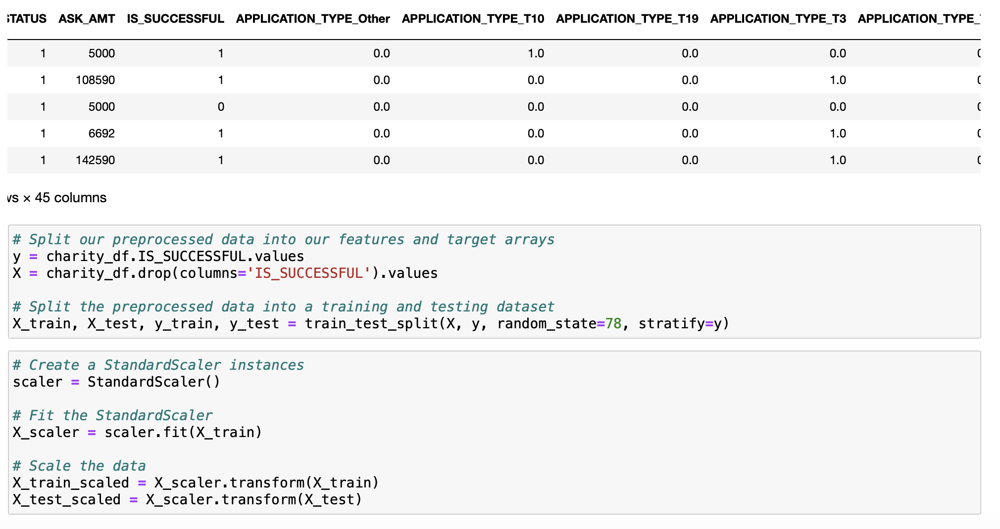
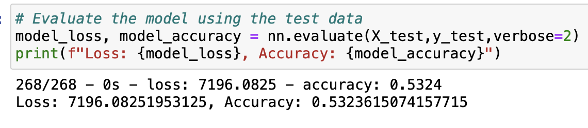
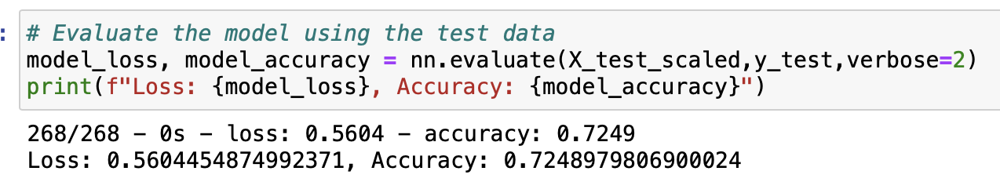

# Neural_Network_Charity_Analysis

## Overview of the analysis:
In this project, we are helping Beks to create a binary classifier that us capable of predicting whether applicants will be successful if funded by Alphabet Soup. We will be using machine learning and neural networks for the features in the provided dataset—charity_data.csv. First, we will prep processing data for a neural network model. Second, we will be compiling, training and evaluating the model. Last, we will optimize the model.
## Results:
### Data Preprocessing
- What variable(s) are considered the target(s) for your model?
Target output is referred to as “y” in TensorFlow, and it is our dependent variable. In our analysis, we would like to see whether or not applicants are successfully funded; therefore, the “IS_SUCCESSFUL” column is our target output. We need to separate this column from the rest of the input data in order to perform our training/test split.
- What variable(s) are considered to be the features for your model?
Input values is referred to features or “X”, which are our independent variables. So our features are “ASK_AMT,” “APPLICATION_TYPE,” “CLASSIFICATION,” “INCOME_AMT,” “SPECIAL_CONSIDERATIONS,” “AFFILIATION_CompanySponsored,” and “STATUS” from the dataset.
- What variable(s) are neither targets nor features, and should be removed from the input data?
We have removed “EIN” and “NAME,” because these two columns have too many unique values and are not imported to the analysis.
  
### Compiling, Training, and Evaluating the Model
- How many neurons, layers, and activation functions did you select for your neural network model, and why?
I’ve tried one hidden layer, two hidden layers, three hidden layers and model checkpoints. For neurons, I’ve changed decreased from 100 to 50 to see if there will be any differences. Different activation functions are used for input and output. The reason for that is the result remains at 53.24% so that I have to change different neurons, layers and activation functions to see if the result of accuracy score can increase.
- Were you able to achieve the target model performance?
I was unable to achieve 75% of the accuracy, and the highest accuracy score is by the deep neural model that is 73.32%. All of the training results for the three attempts are higher than 73%. However, the testing results stays at 53.24%. The reason for that could be the model is overfitting the data.
  
- What steps did you take to try and increase model performance?
I try to increase model performance by removing highly distributed columns, binning and then dropping the unneeded columns, changing the number of neurons for different layers, changing the number of layers, and changing the number of epochs.
## Summary:
Looking at all the results provided by the different hidden layers, the accuracy score is the same for the optimization since we have the values to replace if counts are less than 1,000 to 500 for the “CLASSIFICATION” and “APPLICATION” columns. However, the accuracy score is way higher for the values to replace if counts are less than 1,000 comparing to the 500s. 
  
  This is due to the reason that the model could be overfitting at this point and there are more units play a role in the accuracy. Also, we are determine what to drop, how many to drop, how many hidden layers, how many epochs, and how many neurons for each hidden layer; this could cause the classification problem. I would recommend the random forest model to solve the classification problem because random forest model handles nonlinear data better and it would not run into overfitting problem. 

